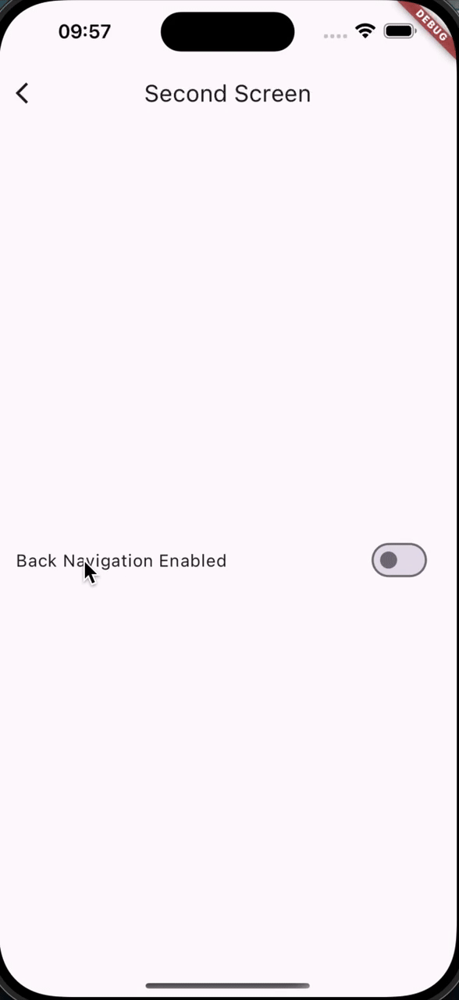

# PopScopeAwareCupertinoRoute

> Note: This package can be used on any platform, and is not specific to iOS.

<br />

### PopScopeAwareCupertinoRouteTransition

The key to this package is a modified version of
Flutter's [CupertinoPageRoute](https://api.flutter.dev/flutter/cupertino/CupertinoPageRoute-class.html),
and [Cupertino Will Pop Scope](https://pub.dev/packages/cupertino_will_pop_scope) which has been
enhanced with the following:

- Visual feedback when users attempt to "swipe to go back" - the screen is allowed to be dragged a bit before it is
  snapped back to place.
- If an enclosing route popDisposition is set to doNotPop, the routes onPopInvoked callback is triggered


A working app using this package can be found in the [example](example/lib/main.dart) folder.




-------

## Usage

To use this package, add `pop_scope_aware_cupertino_route` as
a [dependency in your pubspec.yaml file](https://flutter.io/using-packages/).

## Example

### Import the library

``` dart
// main.dart
import 'package:pop_scope_aware_cupertino_route/pop_scope_aware_cupertino_route.dart';
```

### Configure page transitions

Set the transition builder of the desired platform to `PopScopeAwareCupertinoPageTransitionBuilder` in your theme
configuration.

```dart
// material_app.dart
final theme = ThemeData(
  pageTransitionsTheme: const PageTransitionsTheme(
    builders: {
      TargetPlatform.android: ZoomPageTransitionsBuilder(),
      TargetPlatform.iOS: PopScopeAwareCupertinoPageTransitionBuilder(),
    },
  ),
);

```

###### Make sure the theme is applied to the app.

```dart
// material_app.dart
@override
Widget build(BuildContext context) {
  return MaterialApp(
    theme: theme,
    home: const HomeScreen(),
  );
}
```

###### Using PopScope:

```dart
// my_screen.dart
@override
Widget build(BuildContext context) {
  return PopScope(
    canPop: false,
    onPopInvoked: (canPop) {
      print(canPop);
    },
    child: Container(),
  );
}
```
